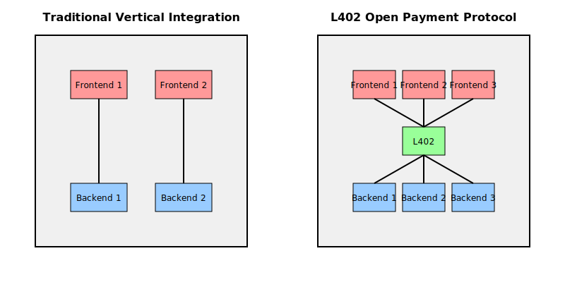
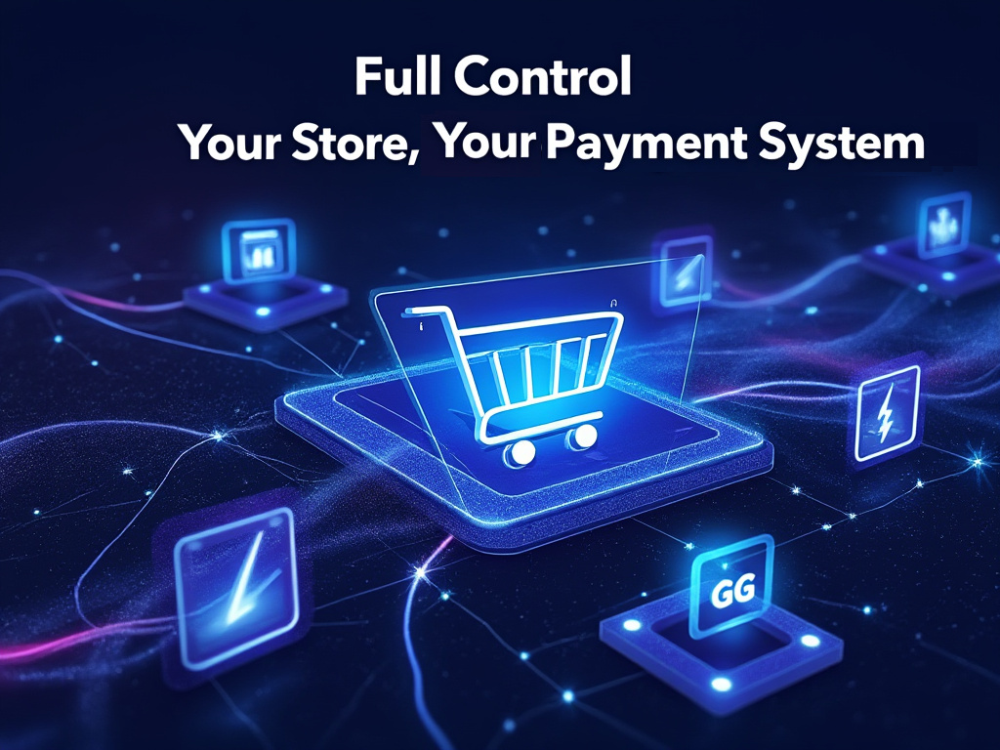

# L402 From Zero to Hero: The Ultimate Guide to Selling Online

---


The internet made sharing information easy, but selling digital content remains hard. L402 changes that by making online payments as simple as HTTP and removing the middlemen and complexity that plague current systems. Imagine selling your e-book or digital artwork without:

- losing a chunk of your earnings to platform fees
- waiting days for payments to clear
- dealing with account suspensions.

L402 enables any client to interact with any server, breaking down the barriers of traditional vertical integration.




This guide helps creators at all levels by providing a clear path from beginner to expert:

1. Start selling in minutes, we handle the rest (No tech skills required)
2. Add your branding (Basic HTML/CSS skills)
3. Run your own store, we process payments  (Some backend coding knowledge)
4. Full control: your store, your payment system (Advanced technical expertise)

Begin where you're comfortable, advance as you grow. Each builds on the last, letting you grow at your own pace. We'll manage the complexity until you're ready.

## Level 1: Fully managed marketplace


Fewsats offers a fully managed solution where you simply upload your files and start selling. It's similar to other marketplaces, potentially cheaper than many, and provides an L402 link that anyone can pay. This approach requires no technical knowledge and offers:

- Listing on [Fewsats Marketplace](https://marketplace.fewsats.com)
- L402 link for each product to share anywhere
- Built-in payment system ([Hub](http://paywithhub.com)) accepting credit cards
- Immediate content delivery to buyers after purchase

This isn't our focus here, but it's a useful reference point. It demonstrates what L402 can do at its simplest level.

If you're curious, you can sign up at https://fewsats.com.

Now, let's explore the more interesting, hands-on implementations...

## Level 2 : Custom Branded Store: Your Look, Our Backend


For creators wanting more control over their storefront's appearance, we offer a customizable React/Redux marketplace.

### Basic Setup

Use one of our marketplace templates (or create your own) to create your own marketplace. The marketplace will call our back-end to retrieve your files (you can filter by your user ID) and customize how it looks to fit your needs. 

Continue using our app.fewsats.com to upload content and manage payouts, keeping things simple on your end.

### Example Implementations

We have a FastHTML version and React one. If you are just beginning, FastHTML is an easier choice because is smaller & easier to read (https://x.com/pol_avec/status/1827017732010750065)

1. Fork our GitHub repo: [L402 React Marketplace](https://github.com/Fewsats/marketplace) or [L402 FastHTML Marketplace](https://github.com/Fewsats/fasthtml-marketplace/tree/main/01_market_react_clone)
2. Customize it. If you’re not an expert just use AI like ChatGPT or Claude to guide you through customization. Ask questions like:
    - "How do I change the background color?"
    - "Where can I add my logo?"
    - "How do I modify the product layout?"
3. Deploy:
Deploying to Vercel or Replit is very easy. Just give them access to your repo and you're set. FastHTML greatly recommends https://railway.app/ for its simplicity and price but we haven’t tested it.

### Getting Paid:

To get paid in this case you have 3 options

- Distribute the L402 links so anyone with a L402-compatible client can buy them.
- Use [Fewsats Hub](https://paywithhub.com) ($) for credit card payments
- Implement Bitcoin-Connect or similar solutions for BTC payments

### Use Cases:

For creators that want better online branding, our customizable storefront offers numerous possibilities:

- For podcasters, envision an audio lounge that extends your show's atmosphere, offering exclusive content that keeps listeners engaged beyond the regular episodes.
- If you're an artist, you might want a gallery with your unique style and brand identity.
- As a course creator, you could design a learning platform that keeps students engaged within your ecosystem, rather than redirecting them to a generic marketplace.
- Coaches and consultants can create a professional space that builds trust and showcases their expertise before a client even books a session.

The key advantage here is control over your brand experience. You're no longer confined to our standard marketplace. Instead, you can craft an environment that represents your brand and resonates with your audience.

This approach is perfect for creators who've outgrown generic platforms and want to offer their audience a more personalized shopping experience, all while keeping the simplicity and security of our L402 payment system.

## Level 3: Run Your Own Store, We Handle Payments


For developers comfortable with backend coding, this level offers more control while still leveraging our backend to deal only with payments. It supports Flask, FastAPI, FastHTML & Django out-of-the-box.

### Basic Setup

1. Install our L402 library:
    
    ```
    pip install l402
    ```
    
2. Set up the authenticator:
    
    ```python
    fewsats_provider = FewsatsInvoiceProvider(api_key="YOUR_API_KEY")
    macaroon_service = SqliteMacaroonService()
    
    authenticator = Authenticator(location='your_domain',
                                  invoice_provider=fewsats_provider,
                                  macaroon_service=macaroon_service)
    
    ```
    
3. Use the decorator on your routes:
    
    ```python
    # In FastHTML
    @app.route("/protected-content")
    @FastHTML_l402_decorator(authenticator, lambda req: (100, 'USD', 'Content description'))
    async def get_protected_content():
    # Your content delivery logic here
        return {"content": "Your premium content"}
        
    # In Flask
    @app.route('/graphql', methods=['GET', 'POST'])
    @Flask_l402_decorator(authenticator, lambda req: (1, "USD", "Content Description"))
    def get_protected_content():
          return {"content": "Your premium content"}
    
    ```
    

### Example Implementations

1. **Full Marketplace (FastHTML)**
A complete marketplace with frontend and backend using FastHTML.
[Github Code](https://github.com/Fewsats/fasthtml-marketplace/tree/main/00_market_full_example)
2. **Storage as a Service: sell files (Flask)**
Backend-only implementation for selling files stored in object storage.
[Fork on Replit](https://replit.com/t/fewsats/czjf93/repls/L402-Server-Storage/view#main.py)
3. **Data as a Service, expose data with GraphQL (Flask)**
Backend-only setup for selling data access through a GraphQL API.
[Fork on Replit](https://replit.com/t/fewsats/czjf93/repls/Flask-L402-Data/view#main.py)

Each example demonstrates different use cases for L402:

- The marketplace shows how to create a full-fledged e-commerce platform.
- The storage example illustrates selling digital files securely.
- The GraphQL API demonstrates monetizing data access.

These examples provide a starting point for your own L402-powered applications. Modify and expand them to fit your specific needs.

### Use cases

Running your own L402 backend opens up some cool possibilities:

- Satellite Imagery Startups: Monetize your unique datasets instantly. No need to move terabytes of data - sell access directly from your servers. Cut costs, maintain control, and scale effortlessly.
- Bitcoin Analytics Firms: Offer real-time access to your insights. Integrate L402 seamlessly with your models for instant, secure monetization. Turn your analytics into a profitable API without middlemen.
- Global Content Providers: Optimize user experience worldwide. Store data where it serves your audience best, reducing latency and costs while ensuring regulatory compliance. Deliver lightning-fast content, tailored to each region.

These examples showcase how running your own L402 backend allows for enhanced privacy, cost efficiency, customization, and direct integrations tailored to your specific business needs.

## Level 4: Full Control - Your Store, Your Payment System



At this level, you're looking at complete control over both your store and the payment system. This setup involves:

- Running your own Bitcoin full node
- Operating a Lightning Network node
- Managing your own L402 server implementation
- Handling all aspects of payment processing and content delivery

This approach offers maximum autonomy but requires significant technical expertise and resources.

### Next Steps:

If you're considering this level of implementation, we'd be interested in discussing your plans. Your use case is likely unique and could provide valuable insights for the L402 ecosystem.

Feel free to reach out to us on X [@Fewsats](https://x.com/Fewsats) or by email at jordi@fewsats.com or pol@fewsats.com

We're committed to advancing L402 technology and are always eager to engage with those pushing its boundaries.